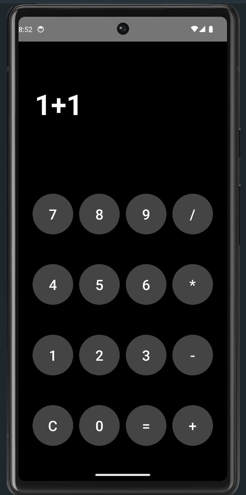

# 🧮 Calculator App

A simple calculator application built using **Jetpack Compose** in Android Studio. This app supports basic arithmetic operations such as **addition**, **subtraction**, **multiplication**, and **division** with a modern UI.

---

## 📸 Screenshot


---

## 🚀 Features
- Perform **Addition, Subtraction, Multiplication, Division**
- **Clear button** to reset the input and result
- **Real-time** display of input and result as you type
- Built using **Jetpack Compose** for a modern UI experience

---

## 🛠️ Tech Stack
- **Kotlin**: Primary programming language
- **Jetpack Compose**: Modern Android UI toolkit
- **Android Studio**: Development environment

---

## 📂 Project Structure
CalculatorApp/ │ ├── app/ # Source code
│ ├── src/main/ # Main directory
│ │ ├── java/ # Kotlin code
│ │ │ └── MainActivity.kt
│ │ └── res/ # Resources (layouts, drawables, etc.)
├── screenshot.png # App screenshot
├── README.md # Documentation
└── .gitignore # Ignored files and directories

## 📝 How to Run
1. **Clone** the repository:
   ```bash
   git clone https://github.com/Moin333/CalculatorApp.git
2. Open the project in Android Studio.
3. Run the app on an emulator or physical device.

Contributing
1. Fork the repository.
2. Create a new branch for your feature:
   git checkout -b feature-branch
3. Commit your changes and open a pull request.

📄 License
This project is licensed under the MIT License.

📧 Contact
For questions or suggestions, contact me at:
GitHub: Moin333
Instagram: moin_ansari003
Gmail: ansarimoin7861@gmail.com