# 🧮 Smart Calculator App

Smart Calculator is a powerful and modern Android application that goes beyond basic arithmetic. Designed with clean architecture and built using **Jetpack Compose**, it provides a responsive, theme-aware, and extendable user experience for **scientific calculations**, **unit conversions**, and **currency exchange**—all packed in one app.

Inspired by best practices in Android development, this app showcases mastery in **state management**, **Room database integration**, and **retrofit-powered APIs**.

---

## 📑 Table of Contents

- [Features](#features)
- [Screenshots](#screenshots)
- [Technologies Used](#technologies-used)
- [Setup](#setup)
- [License](#license)
- [Acknowledgments](#acknowledgments)

---

## Features

- 🔢 **Standard & Scientific Calculator**  
  Switch between basic and advanced scientific calculations.

- 🧾 **History Panel**  
  View past calculations using persistent storage with Room DB.

- 🔁 **Unit Conversion**  
  Convert between units like Area, Length, Volume, Weight, Temperature, Pressure, Power, Speed.

- 💱 **Currency Conversion**  
  Real-time exchange rates using the [Open Exchange Rates API](https://openexchangerates.org/).

- 🌙 **Light & Dark Theme Support**  
  Adapts beautifully based on your system settings.

- 📱 **Modern Compose UI**  
  Fully built with Jetpack Compose for fluid animations and clean interface.

---

## Screenshots

<p align="center">
  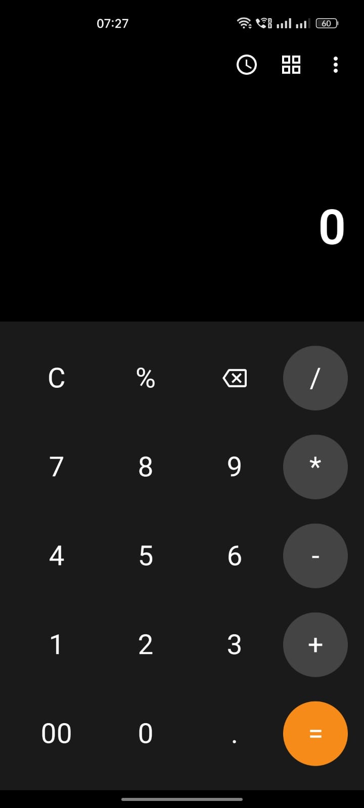
  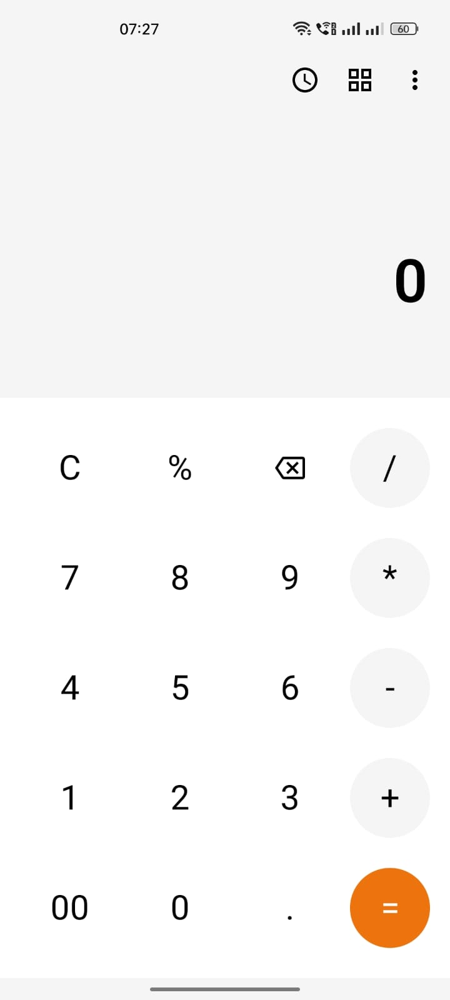
  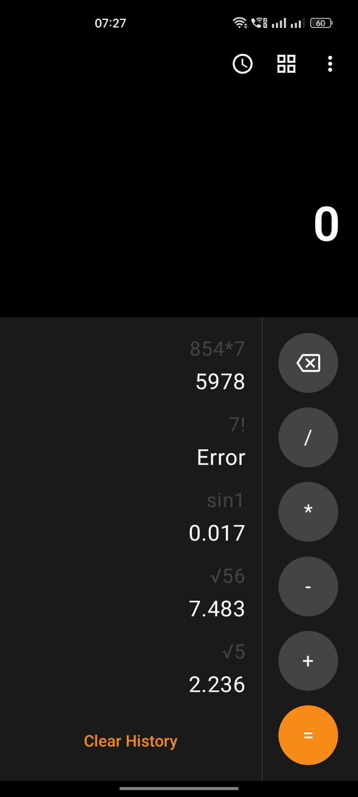
  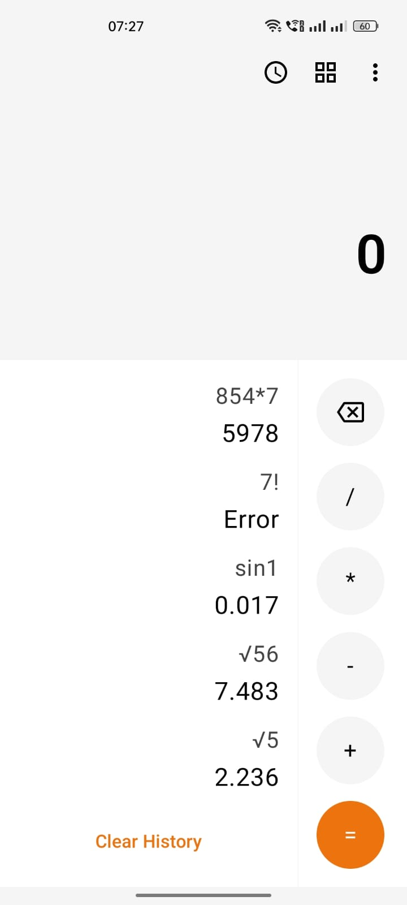
  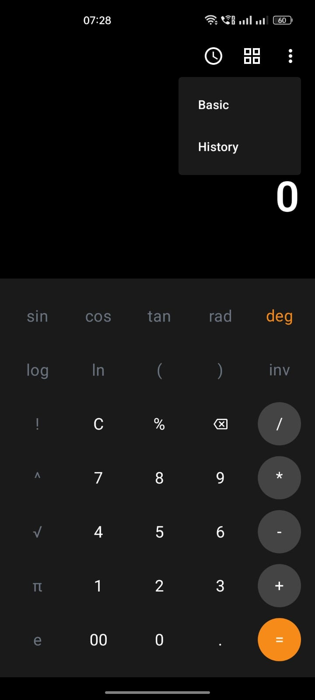
  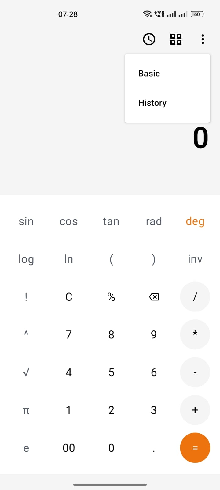
  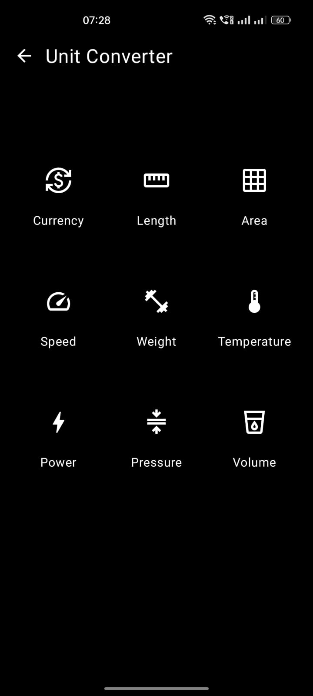
  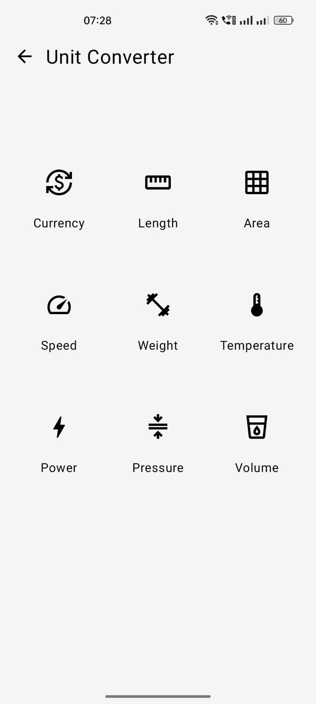
  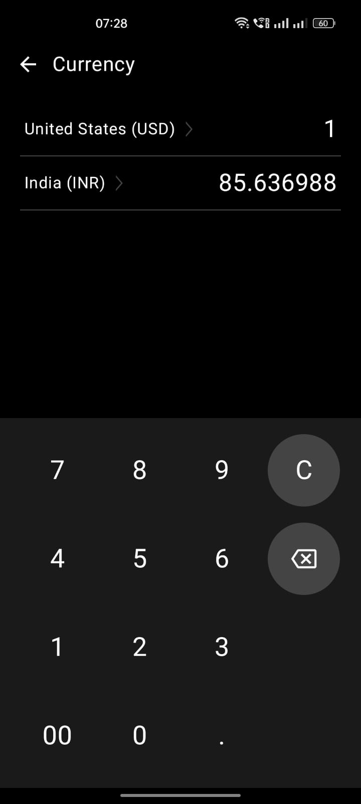
  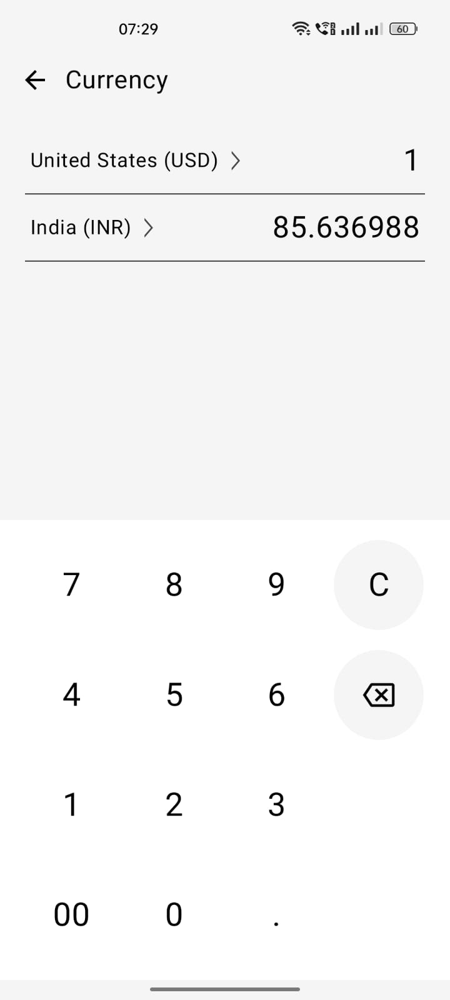
  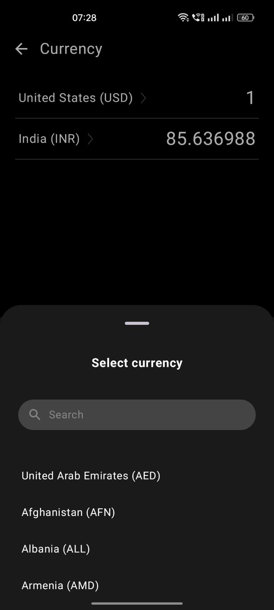
  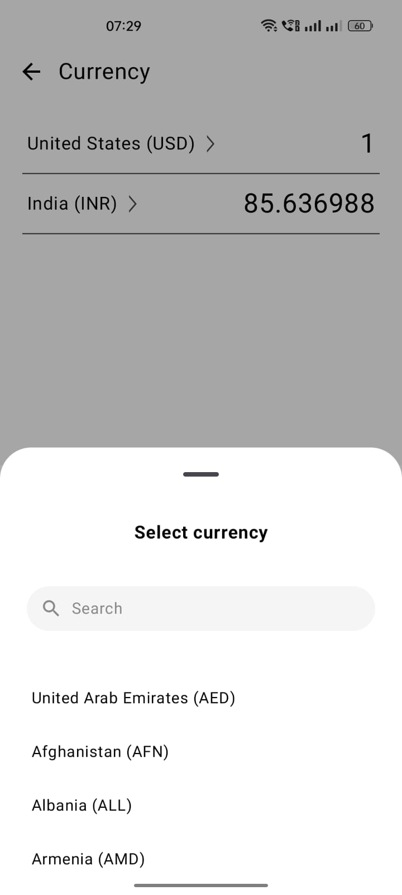
  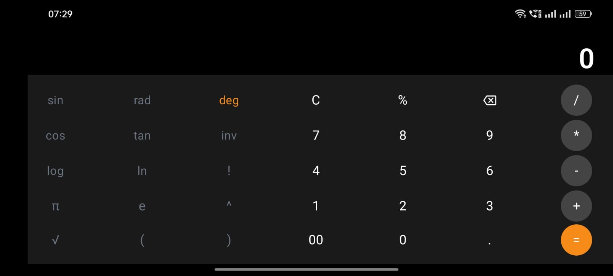
  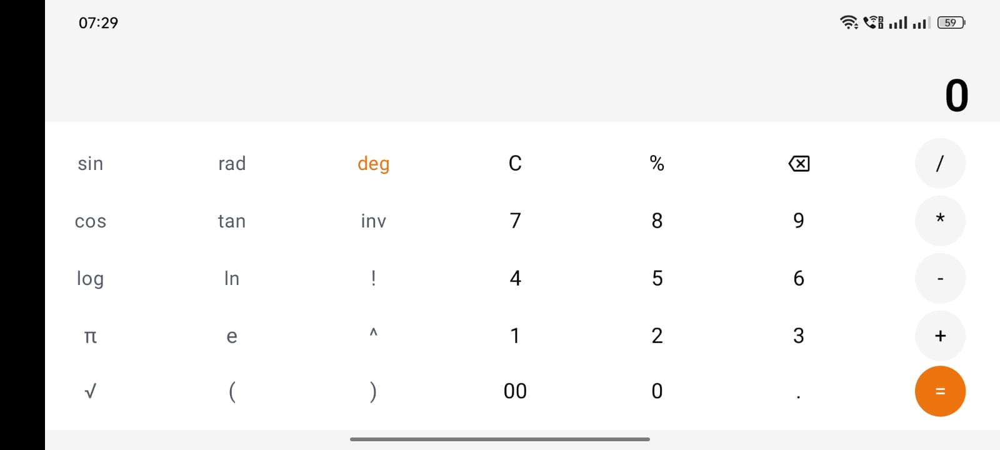
</p>

---

## Technologies Used

- **Kotlin** – Modern, concise language for Android
- **Jetpack Compose** – Declarative UI toolkit
- **Room Database** – Local storage for history
- **Retrofit** – Network requests and API integration
- **Material 3** – UI Components and themes
- **StateFlow** – Reactive and lifecycle-safe data streams

---

## Setup

1. **Clone the Repository**
   ```bash
   git clone https://github.com/Moin333/CalculatorApp.git
   cd CalculatorApp
   ```

2. **Open in Android Studio**
   - Use the latest Android Studio (Hedgehog or above recommended).
   - Open as an existing project.

3. **Sync Gradle**
   - Android Studio should sync dependencies automatically.
   - If not, go to `File > Sync Project with Gradle Files`.

4. **Run the App**
   - Select an emulator or physical device.
   - Click **Run** ▶️ to launch.

---

## License

This project is licensed under the MIT License – see the [LICENSE] file for details.

---

## Acknowledgments

- Inspired by modern Android clean architecture practices.
- Thanks to [Open Exchange Rates](https://openexchangerates.org/) for the free API tier.
- JetBrains, Google, and the Android community for open-source libraries and tools.
